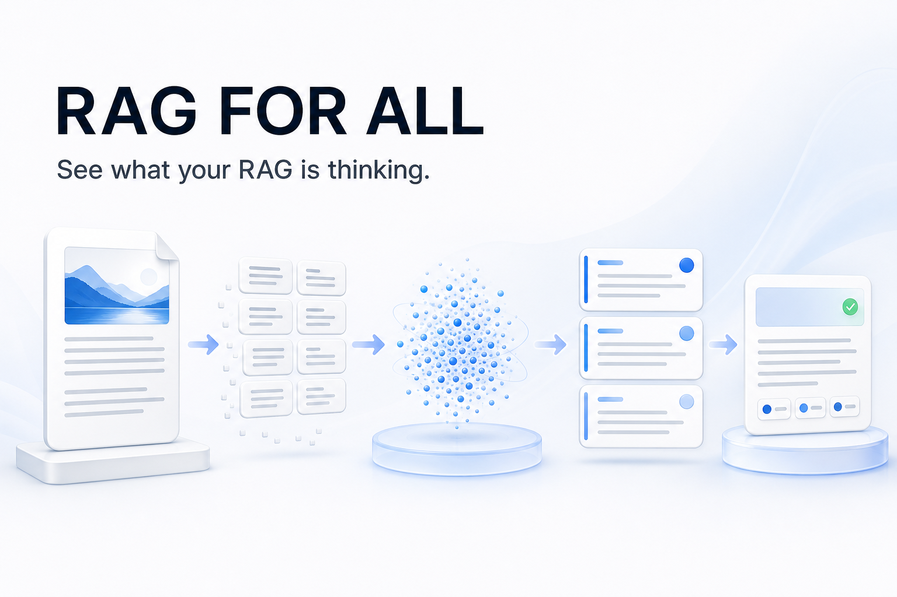

# RAG FOR ALL

**See how RAG works, step by step.**

[Live product](https://ragforall.com) · [Product specification](docs/PRODUCT.md) · [Architecture](docs/ARCHITECTURE.md)



RAG FOR ALL is an interactive visual lab that turns Retrieval-Augmented Generation from a black box into a pipeline you can inspect, change, and compare. Upload a document, ask a question, and follow the evidence through parsing, chunking, embedding, retrieval, reranking, prompt construction, and the final grounded answer.

It is designed for people who have heard of RAG and want to understand what the machinery is actually doing—without requiring them to build the machinery first.

## Why this project exists

An AI agent can reason and act, but it remains generic until it can retrieve the right private or current context. RAG FOR ALL makes that connection visible. Each step explains what changed, why it matters, and what can go wrong; A/B experiments let users change real settings and see the consequences instead of memorizing definitions.

## What is real in the current build

- PDF, DOCX, TXT, and Markdown extraction with a 20 MB limit.
- Exact token-based chunking with adjustable size, overlap, and strategy.
- Local TF-IDF embeddings plus OpenAI semantic embeddings when configured.
- Keyword, vector, and hybrid retrieval with a visual question-to-chunk map.
- Adjustable Top K, second-pass reranking, exact prompt inspection, and citations.
- A/B comparison across two independently configured RAG pipelines.
- A local extractive fallback, so the full journey still works without a paid API.
- Cloudflare D1 metadata and run history, plus R2 document storage.
- Anonymous public sessions, document isolation, rate limits, and hard token budgets.
- Privacy-safe product analytics and a private owner dashboard at `/admin`.
- One deletion path for the original file, parsed text, and related run history.
- Responsive, accessible, white-first product design with original visual assets.

Scanned-PDF OCR, complex table reconstruction, user accounts, billing, and production-scale vector infrastructure are intentionally outside the current scope.

## Pipeline

```text
Document → Parse → Chunk → Embedding → Retrieve → Rerank → Prompt → Answer
                              ↑ question vector          ↓ cited evidence
```

The browser handles the learning experience and local fallbacks. Server routes handle provider calls and persistence without exposing API keys. Cloudflare Workers hosts the application, D1 stores metadata and anonymous analytics, and R2 stores uploaded originals and parsed copies.

## Run locally

Requirements: Node.js 22.13 or newer.

```bash
npm install
npm run dev
```

Then open [http://localhost:3000](http://localhost:3000). The Cloudflare development runtime provides local D1 and R2 storage automatically.

Create a production build with:

```bash
npm run build
```

## Optional credentials

Do not commit API keys. Copy `.env.example` to `.env.local`, add your key there, and restart the development server:

```dotenv
OPENAI_API_KEY=your-key-here
OPENAI_EMBEDDING_MODEL=text-embedding-3-small
OPENAI_RESPONSE_MODEL=gpt-5.6-luna
MODEL_DAILY_USER_TOKEN_BUDGET=250000
MODEL_DAILY_SITE_TOKEN_BUDGET=1000000
ADMIN_OWNER_ID=your-sites-owner-id
ADMIN_OWNER_EMAIL=your-owner-account@example.com
ANALYTICS_HASH_SALT=a-long-random-secret
```

The browser never receives the key. If no key is present, the app still runs end-to-end with local TF-IDF retrieval and an extractive answer fallback. Production values belong in the hosting provider's encrypted environment, never in this repository.

## Verify the pipeline

```bash
npm test
```

The test suite builds the app, checks its server-rendered shell, parses real PDF and DOCX fixtures, verifies token limits, confirms Top K behavior, and proves that different chunk sizes produce different experiments.

## Documentation

- [Product specification](docs/PRODUCT.md)
- [Technical architecture](docs/ARCHITECTURE.md)
- [Chinese project management guide](PROJECT_MANAGER_GUIDE.zh-CN.md)
- [Public-beta launch checklist](docs/LAUNCH_READINESS.md)
- [Public-beta operations runbook](docs/BETA_OPERATIONS.md)

## Open-source scope

This repository includes the complete application source, API routes, RAG logic, database schema and migrations, automated tests, operational documentation, example fixtures, and original interface assets.

It deliberately excludes API keys, local environment files, hosted environment values, user uploads, database contents, analytics data, operational logs, and local Cloudflare state. The project ID in `.openai/hosting.json` is routing metadata, not a credential; deploying or managing the live product still requires owner authorization.

## Development approach

This is a creator-led, AI-assisted software project developed through rapid visual feedback, small tested milestones, and production hardening. The repository preserves both the product decisions and the engineering work behind them: real parsing and retrieval, privacy boundaries, usage controls, analytics, deployment, and operational documentation.

## Git workflow

This repository is intentionally developed in visible milestones. Each commit should answer one plain question, such as “what user-visible capability became real?” Suggested flow:

```bash
git status
git diff
git add .
git commit -m "Build the interactive RAG workspace"
git push
```

The default branch is `main`; feature work uses focused branches and pull requests.

## License

[MIT](LICENSE) © 2026 Xinliang He.
